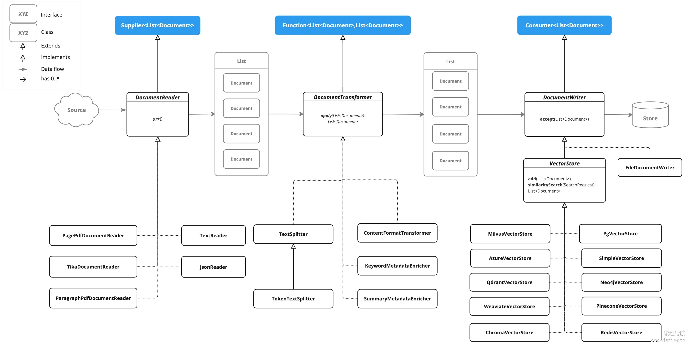
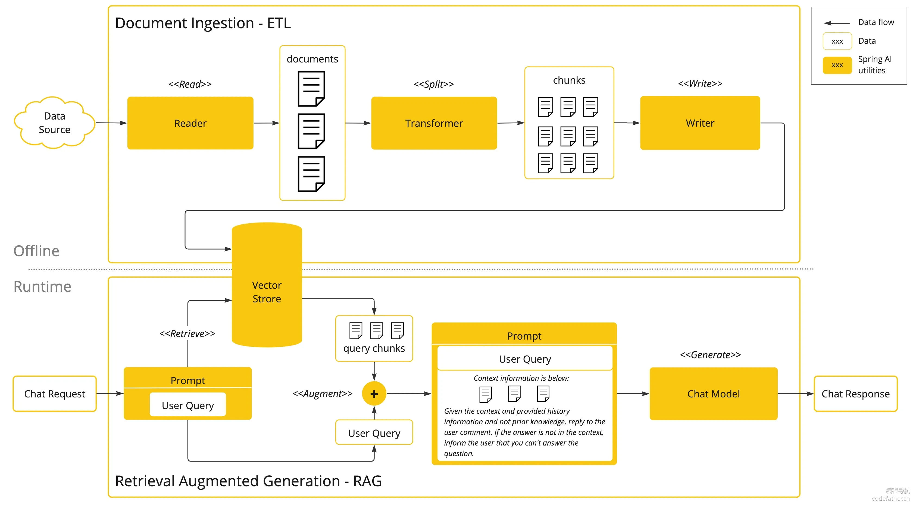

# AI-Agent项目

## 项目介绍

以 **AI 开发实战** 为核心的项目教程，将通过开发 **AI 恋爱大 师应用 + 拥有自主规划能力的超级智能体**，带大家掌握新时代程序员必知必会的AI
核心概念、AI 实用工具和 AI 编程技术，大幅增加求职的竞争力！

`AI 恋爱大师应用` 可以依赖 AI 大模型解决用户的情感问题，支持多轮对话、基于自定义知识库进行问答、自主调用工具和 MCP
服务完成任务，比如调用地图服务获取附近地点并制定约会计划。

后续完成基于 ReAct 模式的 自主规划智能体 YuManus ，可以利用网页搜索、资源下载和 PDF 生成工具，帮用户制定完整的约会计划并生成文档：

## 功能梳理

开发一个 AI 恋爱大师应用、一个拥有自主规划能力的超级智能体，以及一系列工具和 MCP 服务。

具体需求如下：

* AI 恋爱大师应用：用户在恋爱过程中难免遇到各种难题，让 AI 为用户提供贴心情感指导。支持多轮对话、对话记忆持久化、RAG
  知识库检索、工具调用、MCP 服务调用。

* AI 超级智能体：可以根据用户的需求，自主推理和行动，直到完成目标。

* 提供给 AI 的工具：包括联网搜索、文件操作、网页抓取、资源下载、终端操作、PDF 生成。

* AI MCP 服务：可以从特定网站搜索图片。

## 架构设计

## 技术选型

* Java 21 + Spring Boot 3 框架
* ⭐️ Spring AI + LangChain4j
* ⭐️ RAG 知识库
* ⭐️ PGvector 向量数据库
* ⭐ Tool Calling ️工具调用
* ⭐ MCP 模型上下文协议
* ⭐️ ReAct Agent 智能体构建
* ⭐️ Serverless 计算服务
* ⭐️ AI 大模型开发平台百炼
* ⭐️ Cursor AI 代码生成 + MCP
* 第三方接口：如 SearchAPI / Pexels API
* Ollama 大模型部署
* Kryo 高性能序列化
* Jsoup 网页抓取
* iText PDF 生成
* Knife4j 接口文档

## 技术介绍

### ETL

* ETL：数据抽取、数据转换、数据加载

1. 抽取数据（Extract）：从数据库、文件、API 等处获取数据

2. 转换数据（Transform）：对数据进行清洗、去重、去噪等操作

3. 加载数据（Load）：将转换后的数据保存到数据库、文件、对象存储等处

### RAG

#### 检索策略

1. 并行混合检索：

2. 级联混合检索

3. 动态混合检索

#### RAG应用评估

1. 指标
   

* 检索质量评估指标

· 召回率:能否检索到所有相关文档

· 精确率:检索结果中相关文档的比例

· 平均精度均值(MAP):考虑排序质量的综合指标

· 规范化折扣累积增益(NDCG):考虑到文档的相关性和它们在排名中的位置,是一个衡量排名质量的指标

* 生成回答质量评估指标

· 事实准确性:回答中事实性陈述的准确程度

· 答案完整性:回答是否涵盖问题的所有方面

· 上下文相关性:回答与问题的相关程度

· 引用准确性:引用内容是否确实来自检索上下文

2. 流程
   

1.生成评估数据集:创建覆盖不同问题类型的测试集,为每个问题准备标准答案和相关文档。这些测试问题应包括事实性问题、观点性问题、多步骤推理问题等各种类型。

2.运行评估检索过程的程序:对每个测试问题执行检索,与人工标注的相关文档比较,计算检索性能指标。

3.评估回答质量:实际操作中,评估通常分为自动评估和人工评估两种方式。自动评估使用像ROUGE(召回率取向摘要评估)或BLEU(
双语评估替补)这样的指标来衡量生成内容与参考答案的相似度,或者使用更强大的模型来判断回答质量。但自动评估有其局限性,某些方面如创造性、实用性等仍然需要人工评估。这就是为什么很多AI公司会
招人来人工标注。

4.综合分析与优化:识别失败模式和常见错误,比如区分检索失败和生成失败,针对性改进系统组件。

##### 自纠错RAG

##### 自省式RAG

##### 检索树RAG

##### 多智能体RAG

